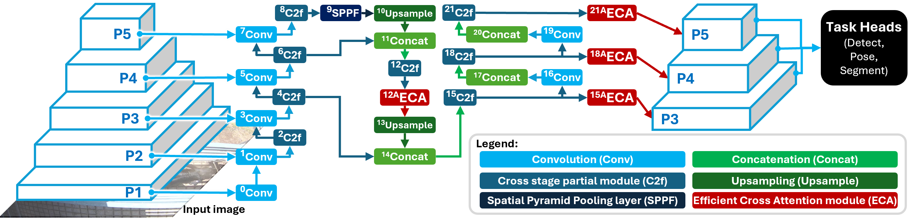

# [mtYOLO: A multi-task model to concurrently obtain the vital characteristics of individuals or animals]([https://github.com/AnimalEyeQ/mtYOLO](https://github.com/AnimalEyeQ/mtYOLO))

This is the official repository for <br/>**[[2024 IEEE ICME Application/Industry Paper] mtYOLO: A multi-task model to concurrently obtain the vital characteristics of individuals or animals]()**
<br/>**Kian Eng ONG, Sivaji RETTA, Ramarajulu SRINIVASAN, Shawn TAN, Jun LIU**
<br/>*Information Systems Technology and Design, Singapore University of Technology and Design, Singapore*
<br/>*[AnimalEYEQ Private Limited](https://animaleyeq.com/home)*


# Paper
[Coming Soon] [2024 IEEE International Conference on Multimedia and Expo (ICME) Official Application/Industry Paper]()

## Citation
[Coming Soon]
<!--
```BibTeX

@INPROCEEDINGS{mtYOLO,
  author={Ong, Kian Eng and Retta, Sivaji and Srinivasan, Ramarajulu and Tan, Shawn and Liu, Jun},
  booktitle={2024 IEEE International Conference on Multimedia and Expo (ICME) Application/Industry}, 
  title={mtYOLO: A multi-task model to concurrently obtain the vital characteristics of individuals or animals}, 
  year={2024},
  volume={},
  number={},
  pages={},
  keywords={},
  doi={}}

```
-->

## Abstract
In multi-task learning, a model learns from various related tasks at the same time. Such a model is especially useful in various practical applications in the real-world (e.g., autonomous driving, precision livestock farming), as they are able to perform inference of various tasks concurrently. In this work, we present mt-YOLO, a single unified multi-task YOLOv8 model, that is trained end-to-end and is able to simultaneously produce the output of all the vital characteristics (e.g., size, keypoints) of the person or animal. Our experiments show that our multi-task YOLOv8 model takes a shorter time to train and performs better than individual tasks. The learning of various tasks can mutually benefit one another during model training and improve its performance, however the tasks may sometimes conflict one another and result in poorer model performance. Hence, in order to further enhance the feature extraction capability of the multi-task model and allow it to learn better features from various tasks, we incorporated the Efficient Channel Attention (ECA) mechanism as part of our multi-task unified model architecture. The ECA mechanism dynamically assigns larger weights to more important information but smaller weights to less relevant information. Our experiments showed that ECA can improve the model's performance without compromising too much on the compute time. Our codes can be found at https://github.com/AnimalEyeQ/mtYOLO.

## Model Architecture


## Datasets
* MS-COCO Person Multi-Task
    * Download images and annotations from [here](https://github.com/ultralytics/ultralytics/pull/5219#issuecomment-1781477032)
    * We would like to thank Andy [@yermandy](https://github.com/yermandy) for providing this dataset.

* CattleEyeView dataset 
    * Download images from https://github.com/AnimalEyeQ/CattleEyeView
    * Multi-task annotations can be found in `./data/CattleEyeView`

* The dataset configuration file can be found in `./config/dataset/cattleeyeview_multitask.yaml` or `./config/dataset/coco_multitask.yaml`.
  * Instructions to modify the configurations can be found in the file.

## Code
* Run the following commands to install mtYOLOv8:
  ```python
  cd ultralytics
  pip install -r requirements.txt
  ```
* The mtYOLOv8 model configuration file and instructions to create other configuration files (e.g., pose, segment, without ECA) can be found in `./config/model/yolov8_multitask_cattleeyeview_ECA.yaml`. 

* The code and instructions to train, validate or predict can be found in `mtYOLO.ipynb`.

* The trained mtYOLOv8 with ECA models for MS-COCO Person Multi-Task and CattleEyeView can be found in `./model_checkpoint`.

## Acknowledgments
We would like to express our gratitude to 
* [ultralytics](https://github.com/ultralytics/ultralytics) for the YOLOv8 codes
* [@yermandy](https://github.com/yermandy) for the [MS-COCO Person Multi-Task dataset](https://github.com/ultralytics/ultralytics/pull/5219#issuecomment-1781477032) and [multi-task codes](https://github.com/yermandy/ultralytics/tree/multi-task-model) 
* [Efficient Channel Attention by Wang et al. (2020)](https://github.com/BangguWu/ECANet) and [YOLOv8-AM by Chien et al. (2024)](https://github.com/RuiyangJu/Fracture_Detection_Improved_YOLOv8) for the ECA codes

